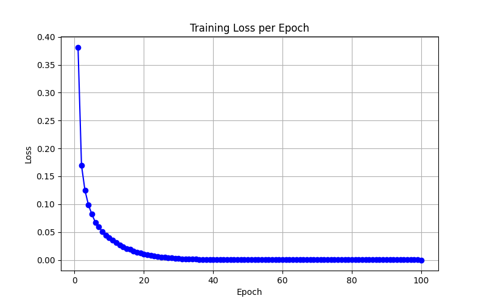
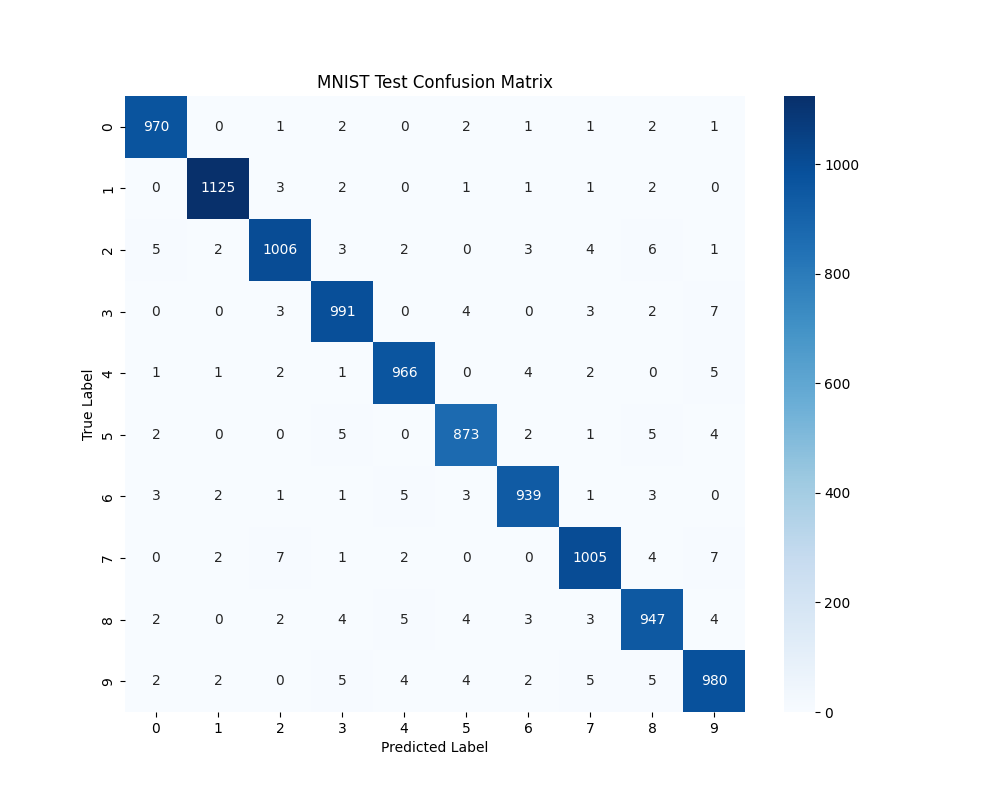

# 📌 Project Title

Short 1-2 sentence description of your project. Mention what it does and why it’s useful.  

---

## 📂 Project Structure

├── app.py # Streamlit app for digit classification UI\
├── confusion_matrix.png # Confusion matrix of test predictions\
├── data/ # MNIST dataset (IDX format)\
│ ├── t10k-images.idx3-ubyte\
│ ├── t10k-labels.idx1-ubyte\
│ ├── train-images.idx3-ubyte\
│ └── train-labels.idx1-ubyte\
├── main.py # Entry point for training\
├── model.pkl # Saved trained model\
├── pyproject.toml # Project dependencies (uv/poetry style)\
├── README.md # Project documentation\
├── server.py # FastAPI backend to serve the model\
├── src/\
│ ├── mnist.py # Dataset loader (IDX to NumPy arrays)\
│ ├── model.py # Neural network implementation (NumPy)\
│ ├── train.py # Training loop\
│ └── utils.py # Utility functions (loss, metrics, plotting)\
├── training_loss.png # Training loss curve\
└── uv.lock # uv lock file for reproducible environments\


---

## ⚡ Features
- ✅ Implements a **3-layer feedforward neural network** from scratch  
- ✅ Uses **NumPy only** (no TensorFlow/PyTorch)  
- ✅ Supports **forward + backward propagation** with Leaky ReLU and softmax  
- ✅ Trains on MNIST dataset in **IDX format**  
- ✅ Visualizes results with **loss curve** and **confusion matrix**  
- ✅ Provides a **FastAPI backend** and **Streamlit UI** for predictions  

---

## 🔧 Installation

This project uses **[uv](https://github.com/astral-sh/uv)** for dependency management.  

Clone the repository:
```bash
git clone git@github.com:Rooneyish/MNIST_digit_classifier.git
cd MNIST_digit_classifier
```

## Install Dependencies

```bash
uv sync
```

## 🏋️ Training Model

```bash
uv run main.py
```

## 🚀 Running the Application

### Running Backend
```bash 
uv run server.py
```

### Running Frontend
Use Different Terminal
```bash 
uv run app.py
```

## 📊 Results
- Training Loss



- Confusion Matrix



## 🔮 Future Improvements

 - Implement a Convolutional Neural Network (CNN) version

 - Add Dropout and Batch Normalization for better generalization

 - Deploy the app to Streamlit Cloud / Hugging Face Spaces

 - Allow camera input for handwritten digit predictions

## 👨‍💻 Author

Ronish Prajapati

GitHub: @[Rooneyish](https://github.com/Rooneyish)
